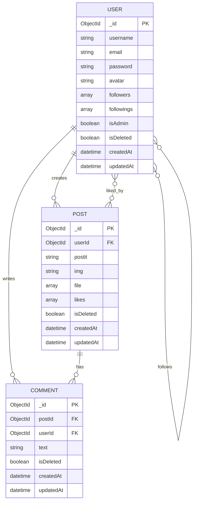

# 📝 Post-it

A RESTful API for a multimedia note-sharing platform. Users can create rich Post-it notes (text, image, video, audio), comment on them, follow other users, and manage their own content — all with JWT-based authentication and soft delete across every resource.


---

## Features

- User authentication with JWT (signup, login)
- Full CRUD for multimedia Post-it notes
- Commenting system with ownership protection
- Follow and unfollow users
- Timeline feed (own posts + followed users' posts)
- Profile post feed by username
- Like and unlike posts
- Soft delete across all resources (users, posts, comments)
- Dynamic avatar generation via Dicebear API
- Global error handling

---

## Tech Stack

| Layer | Technology |
|---|---|
| Runtime | Node.js |
| Framework | Express.js |
| Database | MongoDB (Atlas) |
| ODM | Mongoose |
| Authentication | JSON Web Tokens (jsonwebtoken) |
| Password hashing | bcrypt |
| Security | helmet |
| Logging | morgan |
| Avatar | Dicebear API |

---

## Getting Started

### Prerequisites

- Node.js v18+
- A MongoDB Atlas account and cluster
- Git

### Installation

```bash
# Clone the repository
git clone https://github.com/Lotacodic/Post-it.git
cd Post-it

# Install dependencies
npm install
```

### Environment Variables

Create a `.env` file in the root of the project. Use `.env_sample` as a reference:

```bash
cp .env_sample .env
```

Then fill in your values:

| Variable | Description | Example |
|---|---|---|
| `PORT` | Port the server runs on | `3000` |
| `MONGODB_URI` | MongoDB Atlas connection string | `mongodb+srv://...` |
| `JWT_SECRET` | Secret key for signing JWT tokens | `your_secret_key` |

### Running the Server

```bash
node server.js
```

You should see:

```
Connected to the database
Server is running on port 3000...
```

---

## Database Schema (ERD)



---

## API Documentation

**Base URL:** `https://your-app.railway.app` (replace with your Railway deployment URL)

Protected routes require a Bearer token in the `Authorization` header:

```
Authorization: Bearer <your_jwt_token>
```

---

### Auth

#### Sign up

```
POST /api/auth/signup
```

**Body:**

```json
{
  "username": "testuser",
  "email": "testuser@email.com",
  "password": "password123"
}
```

**Response `201`:**

```json
{
  "message": "Account created successfully.",
  "userId": "64abc123...",
  "username": "testuser",
  "email": "testuser@email.com",
  "avatar": "https://api.dicebear.com/7.x/adventurer/svg?seed=testuser"
}
```

---

#### Login

```
POST /api/auth/login
```

**Body:**

```json
{
  "email": "testuser@email.com",
  "password": "password123"
}
```

**Response `200`:**

```json
{
  "message": "Login successful.",
  "token": "<jwt_token>",
  "userId": "64abc123...",
  "username": "testuser",
  "email": "testuser@email.com",
  "avatar": "https://api.dicebear.com/7.x/adventurer/svg?seed=testuser"
}
```

---

### Users

#### Get a user

```
GET /api/users/:id
```

🔒 Protected

**Response `200`:**

```json
{
  "message": "User fetched successfully",
  "fetchedUser": {
    "imgTag": "",
    "avatar": "https://api.dicebear.com/7.x/adventurer/svg?seed=testuser",
    "username": "testuser",
    "email": "testuser@email.com"
  }
}
```

---

#### Update a user

```
PUT /api/users/:id
```

🔒 Protected | 👤 Owner only

**Body (any updatable field):**

```json
{
  "username": "newusername"
}
```

**Response `200`:**

```json
{
  "message": "Account updated successfully.",
  "user": { ... }
}
```

---

#### Delete a user (soft)

```
DELETE /api/users/:id
```

🔒 Protected | 👤 Owner only

**Response `200`:**

```json
{
  "message": "Account deleted successfully."
}
```

---

#### Follow a user

```
PUT /api/users/:id/follow
```

🔒 Protected

**Response `200`:**

```json
{
  "message": "User followed successfully."
}
```

---

#### Unfollow a user

```
PUT /api/users/:id/unfollow
```

🔒 Protected

**Response `200`:**

```json
{
  "message": "User unfollowed successfully."
}
```

---

### Posts

#### Create a post

```
POST /api/posts
```

🔒 Protected

**Body:**

```json
{
  "postit": "This is my Post-it note!",
  "img": "",
  "file": []
}
```

**Response `201`:**

```json
{
  "message": "Post created successfully.",
  "post": { ... }
}
```

---

#### Get a post

```
GET /api/posts/:id
```

🌐 Public

**Response `200`:**

```json
{
  "message": "Post fetched successfully.",
  "post": { ... }
}
```

---

#### Update a post

```
PUT /api/posts/:id
```

🔒 Protected | 👤 Owner only

**Body:**

```json
{
  "postit": "Updated content"
}
```

**Response `200`:**

```json
{
  "message": "Post updated successfully.",
  "post": { ... }
}
```

---

#### Delete a post (soft)

```
DELETE /api/posts/:id
```

🔒 Protected | 👤 Owner only

**Response `200`:**

```json
{
  "message": "Post deleted successfully."
}
```

---

#### Like / Unlike a post

```
PUT /api/posts/:id/like
```

🔒 Protected

Toggles like on and off. First call likes, second call unlikes.

**Response `200`:**

```json
{
  "message": "Post liked successfully."
}
```

---

#### Get timeline posts

```
GET /api/posts/timeline
```

🔒 Protected

Returns posts from the authenticated user and everyone they follow.

**Response `200`:**

```json
{
  "message": "Timeline fetched successfully.",
  "posts": [ ... ]
}
```

---

#### Get profile posts

```
GET /api/posts/profile/:username
```

🌐 Public

Returns all posts by a specific user.

**Response `200`:**

```json
{
  "message": "Profile posts fetched successfully.",
  "posts": [ ... ]
}
```

---

### Comments

#### Create a comment

```
POST /api/comments/:postId
```

🔒 Protected

**Body:**

```json
{
  "text": "This is a comment!"
}
```

**Response `201`:**

```json
{
  "message": "Comment created successfully.",
  "comment": { ... }
}
```

---

#### Get comments for a post

```
GET /api/comments/:postId
```

🌐 Public

**Response `200`:**

```json
{
  "message": "Comments fetched successfully.",
  "comments": [ ... ]
}
```

---

#### Update a comment

```
PUT /api/comments/:id
```

🔒 Protected | 👤 Owner only

**Body:**

```json
{
  "text": "Updated comment text"
}
```

**Response `200`:**

```json
{
  "message": "Comment updated successfully.",
  "comment": { ... }
}
```

---

#### Delete a comment (soft)

```
DELETE /api/comments/:id
```

🔒 Protected | 👤 Owner only

**Response `200`:**

```json
{
  "message": "Comment deleted successfully."
}
```

---

## Git Branching Strategy

This project follows Git Flow:

| Branch | Purpose |
|---|---|
| `main` | Production reference — never commit directly |
| `develop` | Integration branch — all features merge here first |
| `feat/*` | Feature branches — all work happens here |

**Commit convention:** [Conventional Commits](https://www.conventionalcommits.org/)

```
feat(auth): add JWT login endpoint
fix(comments): validate post exists before creating comment
refactor(models): fix User schema field constraints
chore(structure): scaffold folder architecture
```

---

## License

MIT
