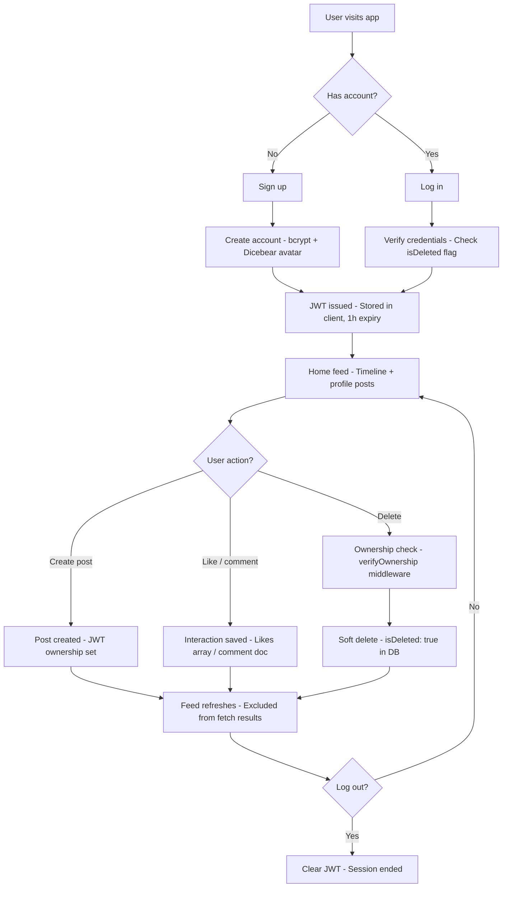

# App flow

This diagram maps the full user journey through the Post-it application.

```mermaid
flowchart TD
    A[User visits app] --> B{Has account?}
    B -- No --> C[Sign up]
    B -- Yes --> D[Log in]
    C --> E[Create account - bcrypt + Dicebear avatar]
    D --> F[Verify credentials - Check isDeleted flag]
    E --> G[JWT issued - Stored in client, 1h expiry]
    F --> G
    G --> H[Home feed - Timeline + profile posts]
    H --> I{User action?}
    I -- Create post --> J[Post created - JWT ownership set]
    I -- Like / comment --> K[Interaction saved - Likes array / comment doc]
    I -- Delete --> L[Ownership check - verifyOwnership middleware]
    L --> M[Soft delete - isDeleted: true in DB]
    J --> N[Feed refreshes - Excluded from fetch results]
    K --> N
    M --> N
    N --> O{Log out?}
    O -- Yes --> P[Clear JWT - Session ended]
    O -- No --> H
```
