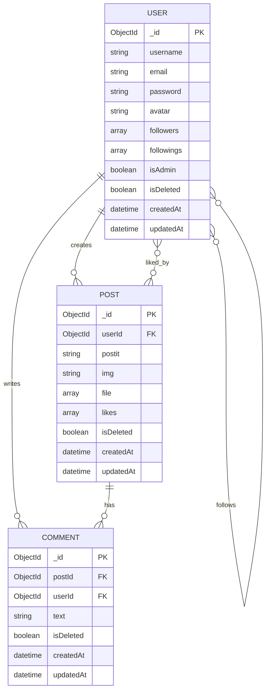

# Entity relationship diagram

```mermaid
erDiagram
  USER ||--o{ POST : creates
  USER ||--o{ COMMENT : writes
  USER }o--o{ USER : follows
  POST ||--o{ COMMENT : has
  POST }o--o{ USER : liked_by

  USER {
    ObjectId _id PK
    string username
    string email
    string password
    string avatar
    array followers
    array followings
    boolean isAdmin
    boolean isDeleted
    datetime createdAt
    datetime updatedAt
  }

  POST {
    ObjectId _id PK
    ObjectId userId FK
    string postit
    string img
    array file
    array likes
    boolean isDeleted
    datetime createdAt
    datetime updatedAt
  }

  COMMENT {
    ObjectId _id PK
    ObjectId postId FK
    ObjectId userId FK
    string text
    boolean isDeleted
    datetime createdAt
    datetime updatedAt
  }
```
